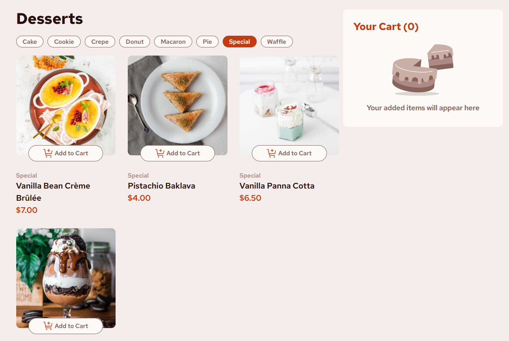
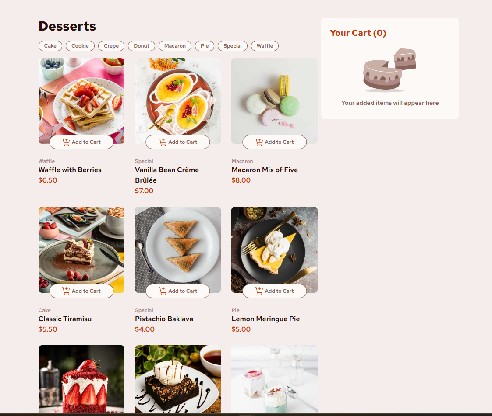
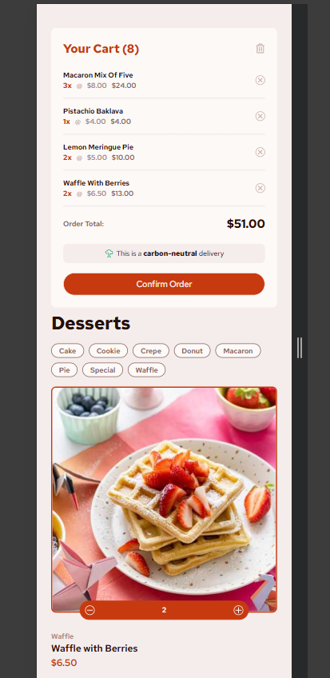

# Frontend Mentor - Product list with cart solution

This is a solution to the [Product list with cart challenge on Frontend Mentor](https://www.frontendmentor.io/challenges/product-list-with-cart-5MmqLVAp_d). Frontend Mentor challenges help you improve your coding skills by building realistic projects. 

## Table of contents

- [Overview](#overview)
  - [The challenge](#the-challenge)
  - [Screenshot](#screenshot)
  - [Links](#links)
- [My process](#my-process)
  - [Built with](#built-with)
  - [Continued development](#continued-development)

**Note: Delete this note and update the table of contents based on what sections you keep.**

## Overview

### The challenge

Users should be able to:

- Add items to the cart and remove them
- Increase/decrease the number of items in the cart
- See an order confirmation modal when they click "Confirm Order"
- Reset their selections when they click "Start New Order"
- View the optimal layout for the interface depending on their device's screen size
- See hover and focus states for all interactive elements on the page
- Bonus challenge: category-based filtering, design of the pills based on current CTAs
- Bonus Write unit tests to ensure all actions work correctly in isolation - I wrote 1 logic test & 1 rendering test. The logic tests if the quantity is added up. The UI test checks if the empty cart displays the correct text. I intend to add more test later.

### My Interpretation of the Challenge

I am using this challenge to practice the concept of Context API studied in the Udemy course. We are replacing the App.jsx' state & removing prop drilling by having Product Context Provider & Cart Context Provider which are consumed by different components.

### Deviations from OG Design & Acceptance Criteria

1. On mobile view, change the order of cart to be first on the screen & the grid to be second. I found that grid stacked in 1 col results in the long scroll (especially since I've added a few more items - see the point below), and the distance between adding an item and having to scroll so faw below to see it added to the cart is quite jarring. Similar problem exists in desktop view where the cart is a sidebar but not fixed (or its simply not stated its fixed positioned?) and when the grid gets large, the scroll is significant. I mention some potential solutions in the Continuous Dev section.
2. Added 'clear cart' icon & method to easily get rid of all items at once.
3. I've created a mockapi & pasted the JSON data in there to practice fetching from a server-hosted platform. I've also expanded on the list of products, adding a few more varieties, with pictures from unsplash - using urls for images as opposed to hosted locally. 
4. In Confirmation Modal, added a 'close' btn as a more intuitive element to close the modal (does the same as 'Start new order' - clearing cart, clearing selected products & filters). To me 'start new order' is not very informative as what it's about to do - another way would be to change btn text to 'Close & start again' - but I guess I'm missing the familiar X sign & feel like there's NO EXIT. Very existensial!
5. Added favicon - [Dessert - created by Febrian Hidayat](https://www.flaticon.com/free-icons/dessert) from Flaticons.

### Screenshot

### Links

- Solution URL: [Product List With Cart - React](https://your-solution-url.com)
- Live Site URL: [Dessert Cart App - React](https://dez-cart-react.netlify.app/)

### Built with

- [React](https://reactjs.org/) - JS library
- [React Icons](https://react-icons.github.io/react-icons/) - React Icons
- [Tailwind](https://tailwindcss.com/) - For styles
- [MockAPI](https://mockapi.io/) - Mock API for desserts data
- [Flaticons](https://www.flaticon.com/) - Free icons with attribution
- [React Testing Library](https://testing-library.com/docs/react-testing-library/intro/) - tests for ui
- [Vitest](https://vitest.dev/) - testing configured for Vite

### Continued development

There are a few solutions I'd like to implement to improve long grid scroll/cart position:
- adding a 'Back to top' btn when scrolling product grid, as well as scrolling to the top/cart position every time an item gets added.
- making cart fixed either at sidebar or header position to always be visible
- (personal favourite): making a little sidebar initially hidden, then opening into view (aka shelf, sliding) on desktop, and serving as a burger menu/nav on mobile to free up space on both layouts. The cart icon to be only displaying the quantity of items added and on clicking, slide open the full cart view (a la Amazon and every other e commerce site).
- sometimes fetch from mockapi returns CORS error & 503. Need to investigate (intermittent)
- write more tests to check core logic & ui

